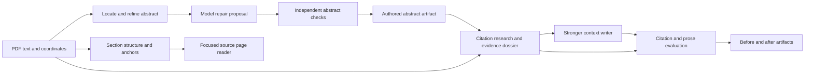

# Abstract fidelity, cited context, and section reading

Status: implementation plan. The tasks below are proposed; they are not completed features.

The goal is to make the first screen dependable and let a reader move from a mapped region
directly into its source pages. Ship this as three independently reviewable tracks, with quality
measurement preceding changes to generation. The suggested delivery order is abstract extraction,
cited context, then the focused reader. The reader has no dependency on either model pipeline and
can ship earlier if desired.

Confirmed scope: “Before” means the research situation leading up to the paper. “After”
means subsequent uses, extensions, critiques, and changes in interpretation. These are distinct
from prerequisites and from the neighboring paragraphs of a selected section.

## What the code does today

- [`prefetch.rs`](../src/analysis/prefetch.rs) locates an `Abstract` heading, gathers text until a
  heuristic boundary, and passes it to orientation. Its boundary list includes `Methods` and
  `Background`, which can also be internal headings of a structured abstract. An unrecognized
  boundary can instead let body text leak into the candidate.
- [`local_cli.rs`](../src/analysis/local_cli.rs) only asks orientation for an abstract when the
  deterministic pass found none. The deterministic result wins when the drafts merge, so a
  nonempty but bad candidate bypasses model correction.
- [`analysis/mod.rs`](../src/analysis/mod.rs) accepts abstract text if whitespace-normalized text
  occurs in the extracted document. This tests provenance, but does not establish completeness,
  correct boundaries, or whether the selected text is actually an abstract.
- External context is one research call using the same model and effort as structural analysis.
  Its notes have source IDs but no before/after role or independently checked evidence passages.
  [`sources.rs`](../src/analysis/sources.rs) checks link reachability, not semantic support.
- [`AbstractView.tsx`](../web/src/components/AbstractView.tsx) renders `outsider_brief` in Before and
  all context notes in After. Normalization derives the brief from those same notes, causing
  duplication without a genuine temporal distinction.
- [`App.tsx`](../web/src/App.tsx) opens a digest on a region click. The map retains all pages;
  [`PdfReader.tsx`](../web/src/components/PdfReader.tsx) renders a single page or spread. Verified
  section anchors and fallback page ranges already exist.

## Module contracts and dependency boundaries

| Module | Consumes | Produces | Owns |
| --- | --- | --- | --- |
| Abstract locator/refiner | Target metadata, extracted pages, layout tokens | Candidate spans, literal text, proposed repairs | Finding and reconstructing the authored abstract |
| Abstract reviewer | Candidate and bounded opening source | Structured correction proposal | Model-assisted boundary and extraction repair |
| Abstract verifier | Original source and final proposal | Accepted result or explicit unresolved state, check report | Provenance, completeness checks, contamination checks |
| Context evidence | Paper identity, abstract, relevant body passages, external research | A frozen evidence dossier | Source discovery, citation relationships, inspected passages |
| Context writer | Evidence dossier | Separate before/after claims with evidence IDs | Useful, concise synthesis using a stronger model profile |
| Context evaluator | Dossier and proposed claims | Citation metrics, independent support verdicts, prose scores | Quality measurement and admission of claims |
| Section focus | Section ID, anchors/page range, shared PDF document | Ordered page subset and reader state | Navigation, rendering, selection, animation |

The verifier must not simply call the locator again and declare agreement. It receives the original
source independently, checks the candidate's coverage and surrounding boundaries, and records why
it accepted or withheld the result. A model's assertion that its output is correct is not a check.

The offline abstract route runs locate → refine → verify without the model. Model-backed analysis
runs the repair/review pass even when the locator produced a candidate, so it can fix a wrong
nonempty extraction. Orientation consumes the accepted abstract; it no longer owns abstract repair.

## Phase 1 — A standalone abstract pipeline

### A1. Fixtures and an independently usable verifier

- [ ] Add `src/abstracts/` with typed candidates, results, and a verifier. Keep it independent of
  thesis generation, external research, and section mapping.
- [ ] Establish reviewed fixtures before replacing the current implementation: labeled and inline
  abstracts; structured abstracts; two-column reading order; page-spanning abstracts; line-end
  hyphens and ligatures; intervening running headers; front matter and adjacent articles; unlabeled
  abstracts; no abstract; and image-only or damaged extraction. Use synthetic fixtures plus
  explicitly accessible source material.
- [ ] Record gold text, page/token spans, permissible typographic repairs, and expected status.
  Keep evaluation fixtures separate from examples used to tune heuristics or prompts.

Measure full-abstract exact match after a narrowly defined normalization, token precision and
recall against the gold abstract, start/end boundary accuracy, non-abstract contamination, and
false acceptance on absent/ambiguous cases. Report normalization rules with the results; fuzzy
similarity must not turn a paraphrase into an accepted authors' abstract.

**Exit check:** the verifier rejects intentionally truncated, body-contaminated, wrong-article,
and paraphrased candidates, including candidates whose every word exists somewhere in the PDF.

### A2. Deterministic location and refinement

- [ ] Move abstract logic out of `analysis/prefetch.rs`. Generate candidates from headings,
  typography/layout, and opening-page position, restricted to the target article.
- [ ] Treat structured abstract subheadings as part of the abstract. Recognize numbered body
  headings, keywords, and publication metadata as possible end boundaries using surrounding
  evidence rather than an unconditional word list.
- [ ] Reconcile raw extraction with coordinate reading order where needed. Remove running
  headers/footers only with recorded evidence and preserve paragraph/subheading structure.
- [ ] Keep literal source spans alongside display text and an explicit repair log. Whitespace,
  ligatures, and proven line-break artifacts can be repaired; mathematical notation, scientific
  hyphens, claims, and qualifications must remain faithful to the source.

**Exit check:** all supported deterministic fixtures pass independently of model availability;
unresolved reading order and unclear boundaries produce an explicit unresolved result.

### A3. Model repair, validation, persistence, and integration

- [ ] Add a dedicated abstract schema and scoped prompt in `prompts/`. Give the model candidates,
  nearby original text, and coordinates; ask it to choose/correct boundaries and propose repairs.
  The model must not summarize, polish the authors' style, or supply absent scientific content.
- [ ] Validate the proposal independently against original source spans. A separate review call
  with fresh context can adjudicate ambiguous completeness; its verdict remains model judgment.
  Allow one bounded repair attempt after failed checks, then retain an unresolved state.
- [ ] Persist `abstract.json` with status (`accepted`, `not_found`, `needs_review`, or `needs_ocr`),
  text, source spans, repairs, check results, source fingerprint, and pipeline/model versions.
  Model/process failures remain distinguishable from “no abstract.”
- [ ] Add a targeted abstract refresh through the existing CLI/API/job machinery. Feed the
  accepted artifact into prefetch and retain `author_abstract` as a compatibility projection.
  Use the artifact's actual source page for the Abstract page link.
- [ ] Preserve a previously accepted result when refresh fails for the same source fingerprint;
  never carry it forward as current when the source has changed. Do not overwrite section maps,
  context, or user highlights during this refresh.

**Exit check:** model stubs demonstrate valid repair, rejected invention, truncation, failed
review, cache reuse/invalidation, and targeted retry. The held-out extraction report records
accuracy and failure modes. No accepted held-out case may contain a material omission, addition,
or wrong source attribution. Unsupported cases must be visible rather than silently invented.

This phase can ship and improve the Abstract view before the context work is ready.

## Phase 2 — Citation-aware context and a stronger writing pass

### C1. Evidence contract, baseline, and metrics

- [ ] Add `src/analysis/context/` for evidence, synthesis, and evaluation; keep public URL checking
  in the existing shared verifier. Add a versioned context evidence/assessment schema.
- [ ] Represent `before` and `after` explicitly. Each contains atomic claims with evidence IDs;
  each evidence item identifies a source, an inspected passage/location, its relationship to the
  target paper, and retrieval date. Preserve publication date and the date of any historical
  event separately. A later history can support a before claim if its passage establishes the
  earlier event.
- [ ] Build a frozen dossier for each benchmark paper and score current outputs against it.
  Reuse the existing learning-ramp rubric's specificity, fidelity, economy, and unsupported-claim
  criteria; add a context-specific scorecard rather than changing old experiment judgments.

| Metric | Measurement | Interpretation |
| --- | --- | --- |
| Citation coverage | Externally checkable claims with evidence IDs / externally checkable claims | Does every factual claim have a trail? |
| Citation support precision | Supporting claim–evidence links / checked claim–evidence links | Does each cited passage support what it is cited for? |
| Supported-claim rate | Claims fully supported by their combined evidence / assessed claims | Are all parts and qualifiers of each claim supported? |
| Passage provenance | Evidence passages located in the inspected source / proposed passages | Is the quoted evidence actually there? |
| Temporal accuracy | Before/after claims with supported chronology / temporal claims | Is the claim placed in the correct history? |
| Citation relationship accuracy | Supported uses, extensions, critiques, or antecedents / claimed relationships | Does “cites” really mean the relationship asserted? |
| Reading usefulness | Blind 0–4 specificity, explanatory value, and economy scores | Does the note help someone understand this paper? |
| Duplication | Human-rated repetition of abstract/thesis or the other context card | Does this add useful information? |
| Abstention and availability | Unsupported omissions, justified abstentions, source access failures | Distinguishes honest limits from a weak pipeline |
| Cost and latency | Calls, measured usage when available, elapsed time, cache hits | What does the quality improvement cost? |

Structural counts and source matches can be deterministic. Entailment, chronology interpretation,
and usefulness need independent assessment against the inspected evidence, with a human-reviewed
benchmark. Report numerator, denominator, unknowns, and coverage; empty output is not perfect
precision. Keep link reachability separate from all semantic scores.

Citation counts, reference/citing-paper relationships, and the dates of citing works may help
discover influential follow-ups. If collected, persist the provider, retrieval date, and coverage
limits, deduplicate preprint/published versions, and leave unavailable values unknown. Counts do
not establish correctness, consensus, or which idea a later work used. Field/year-normalized
influence is optional until a data provider supplies a defensible comparison population.

**Exit check:** scorecards catch a working but irrelevant citation, partial support, unsupported
reception, a mistaken citation relationship, chronology errors, duplicate prose, and empty output.

### C2. Research, then synthesis, then independent review

- [ ] Research backwards through relevant antecedents and forwards through citing/later works.
  Inspect the actual passages supporting each proposed relationship; freeze them into the dossier.
  Abstracts alone are insufficient when the claimed mechanism or relationship needs body evidence.
- [ ] Give the writer the dossier plus the accepted abstract and relevant target-paper passages.
  Separate evidence gathering from writing so retries and A/B comparisons use the same evidence.
- [ ] Introduce a configurable, more capable context model and reasoning profile independent of
  orientation and structure. Pin the actual model/profile in every result. Select the default
  through a context-only comparison; do not increase the expense of unrelated stages.
- [ ] Write **Before the paper** as the concrete problem, prior approach, and unresolved gap that
  make the contribution intelligible. Write **After the paper** as specific uses, extensions,
  disputes, or limits in later work. Keep each to one short paragraph, with claim-level citations.
  Omit unsupported content; recent or obscure papers need not have an invented afterlife.
- [ ] Evaluate claims against the dossier in a separate call without the writer's reasoning or
  self-assessment. Keep semantic verdicts, reasons, and the exact supporting passages. A failing
  claim is repaired once or withheld; source reachability checks still run before publication.

**Exit check:** compare the current and proposed writers on a frozen dossier across at least three
papers and three generations per condition, following the existing experiment methodology. Also
evaluate full retrieval separately so better prose cannot conceal worse evidence. Require no hard
reject, full citation coverage for published factual claims, and the rubric's one-point target
gain without material fidelity/economy regression. Report unjudged cases and measured cost.

### C3. Integration and selective rollout

- [ ] Persist separate before/after results and assessment metadata; render each in its own card
  with its own citations. Update Markdown export and Rust/TypeScript/schema contracts together.
- [ ] Stop displaying `outsider_brief` as Before when it is just the merged context notes. Older
  artifacts retain readable legacy context but are not automatically assigned a temporal role.
- [ ] Add a context-only refresh with separately cached evidence, writing, and review stages.
  Keep the last accepted context visible during refresh and distinguish a research failure from
  an evidence-backed abstention. Allow context to finish after abstract/structure are usable.

**Exit check:** API and browser checks cover distinct cards, complete citations, old artifacts,
partial failures, selective retry, and a refresh that leaves extraction, structure, and highlights
unchanged. Roll out to a reviewed sample before any wider regeneration.

## Phase 3 — Click a region, read its pages

### R1. Page scope and reusable PDF rendering

- [ ] Extract shared PDF document lifecycle and page rendering from `SourceMap`/`PdfReader`.
  Load one document per active paper and reuse it across map and reader surfaces. Keep text
  selection, page coordinates, inversion, clarification, and citation saving working.
- [ ] Add a pure section-scope helper: use valid verified start/end anchors first, then the
  existing page range; clamp to the actual document. Preserve original page numbers, include
  both boundary pages, and produce an ordered, unique subset.
- [ ] Add a `SectionReader` that renders only that subset as a continuous, scrollable column.
  Highlight the selected section's actual text bounds when available. A fallback page range
  provides whole pages without pretending to have exact boundaries.

**Exit check:** fixtures cover a section within one page, several sections sharing a page,
cross-page sections, a last-page section, legacy ranges, and malformed spans. Only pages belonging
to the resolved subset appear, and long sections render nearby pages lazily.

### R2. Focused layout and navigation

- [ ] Introduce explicit overview/focused-section state. A click or keyboard open selects one
  section ID, opens its page reader on the left, and shows its digest on the right.
- [ ] Keep a compact whole-paper locator visible, with the selected pages and section marked.
  Give the focused reader and digest independent scrolling. The library remains a separate rail;
  collapse it when needed for width and restore the previous preference when focus closes.
- [ ] Start at the section's first anchor when known, otherwise the first scoped page. Switching
  regions updates the subset and digest together. A source link within the subset scrolls the
  reader; “Open full paper” moves to the corresponding original page in Text.
- [ ] On close/Escape, restore the previous map scroll position, column count, and focused region.
  Paper switches clear section state. Keyboard scrolling targets the active pane. At narrow
  widths, offer source/digest tabs while retaining a compact paper-position indicator.

**Exit check:** browser tests cover click, keyboard open/close, changing regions, source links,
paper switching, scroll/focus restoration, text selection, and narrow layouts.

### R3. Page movement and visual polish

- [ ] Animate selected page rectangles from the overview into the left reader column, while
  unrelated pages recede and the digest settles on the right. Use stable paper/page identities
  and measured before/after rectangles; do not animate heavy PDF rendering itself.
- [ ] Render the focused text layer at its final size, with temporary page snapshots/transforms
  providing movement. Preserve the source content throughout loading; avoid a blank interstitial.
- [ ] Support interrupted transitions, rapid region changes, resize, and reduced-motion settings.
  Keep interactions available after cancellation and never carry transforms into text selection.

**Exit check:** inspect a screenshot-sized desktop viewport, a narrow viewport, and reduced motion;
exercise rapid selection while pages load and verify accurate selection after the animation.
The functional reader from R2 can ship before this polish.

## Cross-cutting delivery rules

Each stage has its own schema/version, source and input fingerprints, prompt/model/profile cache
keys, typed status, and atomic output. Include metadata and layout dependencies where used. Prompt
or model changes invalidate that stage and its consumers, not the entire paper. Abstract-dependent
context becomes stale when the accepted abstract changes; the section reader remains unaffected.

The existing job tracker must report actual stage transitions rather than marking all branches
active at once. Distinguish cached, running, accepted, unresolved, and failed work. Preserve completed
artifacts on a sibling-stage failure and keep the last accepted product view usable. Serialize
writes per paper so independent refreshes cannot overwrite each other's results.

Recommended review units, in order:

| Unit | Depends on | Shippable result |
| --- | --- | --- |
| A1 | Existing extraction/layout | Abstract verifier and benchmark |
| A2 | A1 | Better deterministic extraction |
| A3 | A2 | Reviewed abstract artifact and selective refresh |
| C1 | Existing experiment machinery | Context evidence contract and baseline metrics |
| C2 | C1; A3 for production abstract input | Stronger, evaluated context pipeline |
| C3 | C2 | Distinct before/after cards and selective refresh |
| R1 | Existing section spans and PDF renderer | Shared rendering and scoped pages |
| R2 | R1 | Scrollable source beside the selected digest |
| R3 | R2 | Animated transition and visual polish |

Use targeted Rust tests for extraction/admission/cache behavior and stub model calls for orchestration.
Use browser smoke fixtures for reader interaction and context rendering. Run formatting, Clippy,
backend tests, frontend typecheck/lint/build, and the affected smoke suites before shipping code.
Model quality is established by the recorded benchmark, not by passing stub tests. New tests and
benchmarks should be self-contained; legacy corpus-based smoke tests need an explicitly accessible
fixture path and must not traverse restricted library locations.
